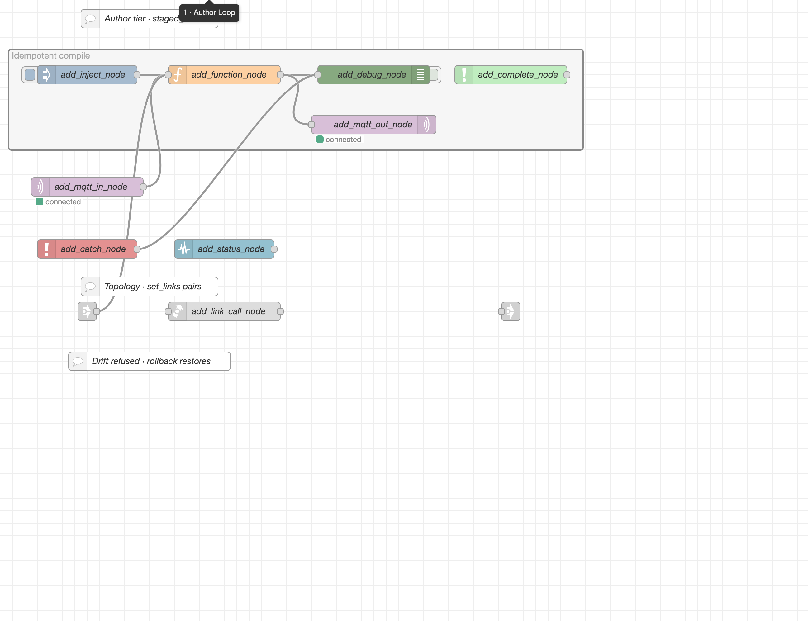
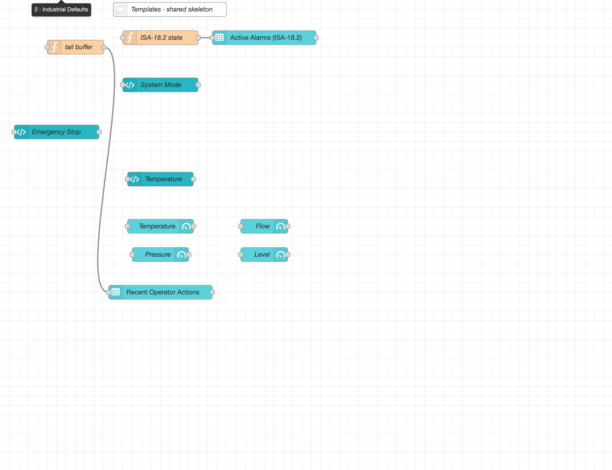
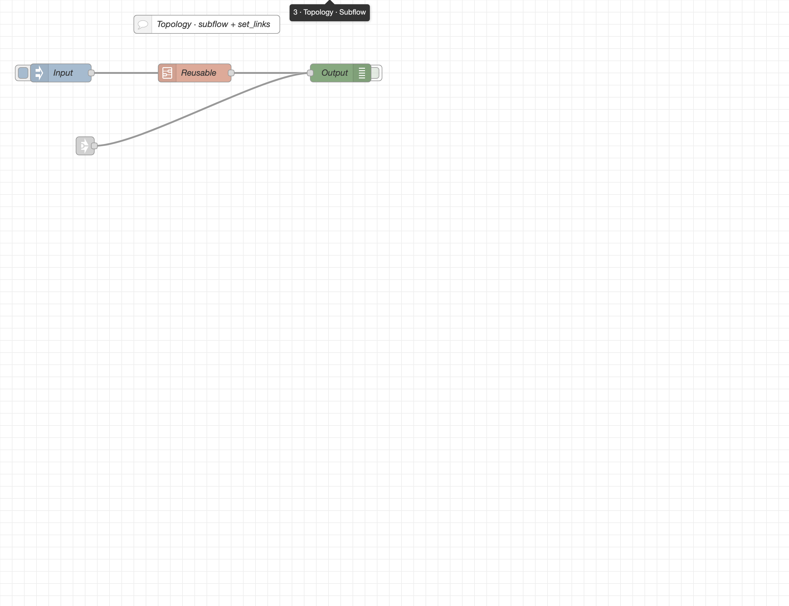
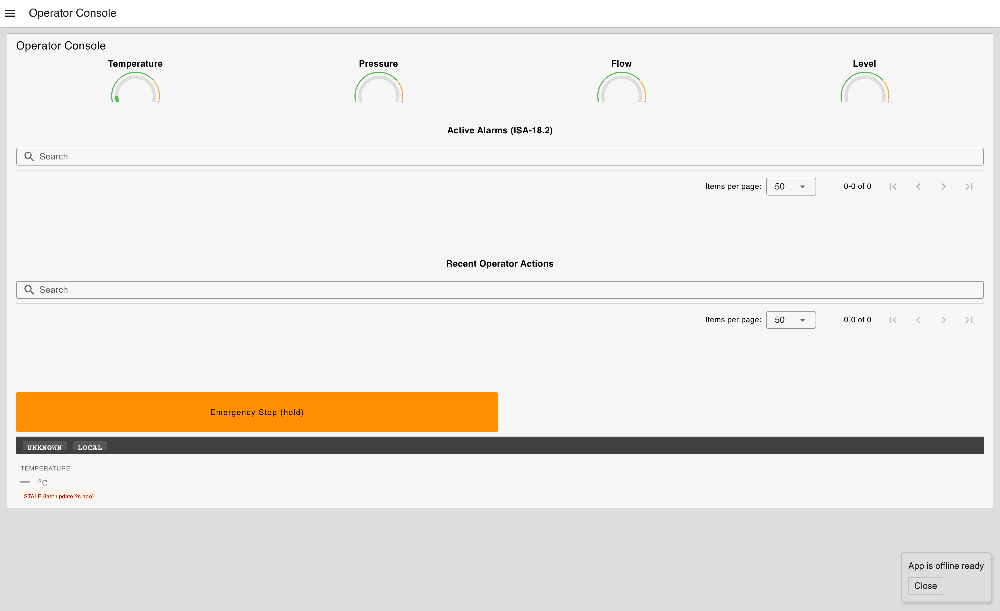

# FlowOtter

**An MCP server that lets AI agents safely manage Node-RED flows.**

Node-RED stores its entire flow graph in a single `flows.json` document. Letting an agent edit that file directly is fragile in practice: node IDs drift across runs, wires end up malformed, dependent config nodes go missing, and a "deploy" can land on top of changes someone else made minutes earlier. FlowOtter inserts a typed authoring layer between the agent and `flows.json` — it compiles, validates, diffs, and (when explicitly enabled) deploys with a snapshot the agent can roll back to. The safety surface — byte-identical idempotent compilation, snapshot-before-deploy with hash-drift refusal, tiered env-gates with read-only as the default, substring-level secret redaction, and ID preservation across runs — is what separates this from a thin Admin-API wrapper.

If you cloned this repo via an agent (Claude Code, Cursor, etc.), the project-scoped `.mcp.json` registers FlowOtter automatically — `npm install && npm run build`, restart the client, and the agent has the read tier available. Write/deploy tiers stay gated behind env flags documented in [Safety Model](#safety-model).

## Status

**v1.3.0 — architectural redesign: methodology, catalog, visual authoring, dashboards, ISA-101.** Introduces a methodology playbook surfaced in the MCP `instructions` field, a structured capability catalog (`get_authoring_guide`), Node-RED version detection with feature gating, a `plan_flow` methodology spine, a response-side soft-nudge guidance system, named toolsets for progressive disclosure, MCP elicitation gating destructive operations, internal dagre/elkjs layout helpers, authoring schemas for the full Dashboard 2.0 widget catalog (24 widgets), 4 ISA-101 operator-screen validators, and 5 user-facing slash-command MCP prompts. The v2.0.0 line adds default-on `layout_flow`, declarative spec authoring, and the consolidated tool surface described below. See [`CHANGELOG.md`](CHANGELOG.md) for the per-item summary and [`docs/DESIGN.md`](docs/DESIGN.md) for the design rationale (and v2 roadmap). Prior lines: v1.2 closed path-traversal exposure on `set_target`, fixed audit/subflow correctness bugs, hardened HTTP retry semantics. v1.1 fixed lossy roundtrip and wired the previously dead config knobs.

### Tool surface (default visible: 21 tools; 75 registered)

Default visible tools are filtered by **toolsets** — named groups that progressive-disclose by intent. v2.0.0 consolidates the default surface to 21 tools: 5 core plumbing tools plus 16 intent-shaped read, authoring, layout, and deploy tools. All registered tools advertise `outputSchema` and return `structuredContent` on success; the legacy JSON text content remains for compatibility.

- **Default core plumbing** — `health_check`, `set_target`, `clear_target`, `list_available_toolsets`, `enable_toolset`.

- **Default intent surface** — `get_authoring_guide`, `list_flows`, `get_flow`, `validate_flow`, `render_flow_png`, `preview_flow_diff`, `get_staged_change`, `stage_spec`, `validate_spec`, `plan_flow`, `stage_changes`, `discard_staged_change`, `layout_flow`, `deploy_staged_change`, `rollback_last_change`, `set_flows_state`.

- **Demoted but callable** — `discovery`, `analyze`, `snapshots`, `audit`, and per-op `author` toolsets are hidden from `tools/list` by default since 2.0.0 but still callable through the multi-minor deprecation window. Call `enable_toolset(name)` to re-list them. Per-op authoring is superseded by `stage_spec` / `stage_changes`; enable `author` when direct editing tools such as `add_node`, `move_node`, `set_wires`, or `set_links` are needed. Removal is no earlier than 2.2.0.

- **Specialists and dangerous tools** — `author_specialists` remains opt-in and is not callable until enabled. Dangerous tools still require the dangerous tier gates; when `ENABLE_DANGEROUS_TOOLS=true` surfaces them, the same destructive confirmation path applies.

Use `list_available_toolsets` to see each toolset's current visibility, hidden-callability, and supersession record.

### User-facing slash commands

FlowOtter ships 5 MCP **prompts** that surface as `/mcp__flow-otter__<name>` in Claude Code (and equivalent menus in other MCP clients) — they're how the _user_ discovers FlowOtter workflows:

- `/mcp__flow-otter__new_flow` — full plan → wire → deploy walkthrough.
- `/mcp__flow-otter__build_operator_dashboard` — composes an ISA-101 operator dashboard from the built-in operator-grade templates.
- `/mcp__flow-otter__refactor_to_subflow` — fold selected nodes into a reusable subflow.
- `/mcp__flow-otter__explain_my_flow` — structured walkthrough.
- `/mcp__flow-otter__review_my_flow` — full review with ISA-101 explanations.

### Verification

`777 unit + 17 property + 85 integration tests`. Property tests run fast-check at `numRuns:1000` and exercise junctions, tab `locked`/`env`, group geometry, comment size, and layout determinism in the round-trip arbitraries.

## Showcase

The three tabs below were authored end-to-end through MCP calls in a single agent session against a sterile Node-RED 3.1 stack. Each section gives the kind of prompt a user might write, the resulting flow, and an honest read on what FlowOtter handled versus what the agent still had to know.

### Tab 1 — Author → Stage → Deploy → Observe → Rollback

> _"Stand up a tab that exercises every common author tool. Add inject, function, debug, plus catch, status, complete, mqtt in, mqtt out, link in, link out, link call. Label each node with the MCP tool that produced it. Wire inject → function → debug, and fan function's output to mqtt out via `set_wires`. Pair link_call to link_in with `set_links`. Group the canonical author loop as 'Idempotent compile' and drop comments explaining the staging contract."_



**What FlowOtter took care of.** Each `add_*_node` call returned a `staged_hash` and a `diff_summary` so the agent could reason about the staged change before deploying. Authoring keys (`_authoringKey`) are preserved across re-runs — running the same prompt twice produces byte-identical `flows.json` with stable IDs. `set_wires` rejects cross-tab wiring (point at link nodes instead), and `set_links` rejects pairing anything that isn't a `link in`. The validator caught off-grid positions and would have caught duplicate `link in` names within the tab.

**What the agent still had to bring.** Node-type-specific config the toolkit doesn't model: `link call` rejected `links: []` until `linkType: "dynamic"` was set; `complete` failed validation without a `scope` array pointing at a real node id; `inject` required `repeat` (even an empty string). Layout coordinates are agent-supplied — auto-placement stacks new nodes adjacent and the `bbox-overlap` lint will warn, but the agent has to actually move them.

### Tab 2 — Template composition (operator-console example)

> _"Lay down an operator console using the six bundled dashboard-2 templates: `dashboard_2_alarm_panel`, `dashboard_2_mode_banner`, `dashboard_2_confirmed_button` (hold-to-confirm e-stop), `dashboard_2_live_value` (with stale-data badge), `dashboard_2_gauge_grid` (four process metrics), `dashboard_2_audit_log_tail`. All widgets should share one ui-base / ui-page / ui-group skeleton — no duplicate scaffolding."_



A handful of the bundled templates use opinionated defaults loosely inspired by industrial-HMI standards — `dashboard_2_alarm_panel` borrows the ISA-18.2 state-machine vocabulary (UNACK/ACK/RTN/SHELVED), `dashboard_2_mode_banner` and `dashboard_2_confirmed_button` lean on ISA-101 ideas (grayscale base, hold-to-confirm destructive actions). v1.3.0 adds four ISA-101 enforcement validators (`unbounded-chart-append`, `screen-clutter`, `saturated-color-outside-alarm`, `button-group-color-decoration`) that flag the most common operator-screen anti-patterns. **Standards conformance was not a goal of this project**; these were one author's starting points and would need to be developed considerably further to be appropriate for actual industrial deployment.

**What FlowOtter took care of.** Six successive `instantiate_template` calls reused one ui-base + ui-page + ui-group via the `ensureSkeleton` helper — instead of stamping six separate dashboards, every widget points at the same `Operator Console` group. The `dashboard-2-hierarchy` validator confirms every widget reaches an existing ui-group, `dashboard-2-required-fields` flags widgets missing per-type required fields, and `dashboard-2-destructive-needs-confirm` would catch a `ui-button` with destructive labels not paired with a confirmation widget.

**What the agent still had to bring.** Node-RED runtime semantics that FlowOtter's validators don't replicate: `ui-gauge` segments must fall within the gauge's own `[min, max]` (a Pressure gauge with max=10 threw at runtime because the default `from: 70` segment was out of range); `ui-table` v2 requires a numeric `maxrows` field (FlowOtter let `null` through, Node-RED rejected it); the `mqtt in`/`mqtt out` typed author tools don't auto-create a `mqtt-broker` config node — the agent has to add one and wire it via the `broker` field. These are real-runtime constraints owned by each plugin, not flow-topology rules the toolkit can sense.

### Tab 3 — Topology · Subflow + Cross-Tab Links

> _"Create a reusable subflow with its instance on a dedicated tab. Add a `link in` here that's the cross-tab counterpart of Tab 1's `link out` — pair them via `set_links` so the Tab 1 outbound resolves to this tab's entry. Wire the link in to the subflow's debug so we can see what arrives."_



**What FlowOtter took care of.** `set_links` is the only tool here that crosses tab boundaries — it validates that the source is `link out` or `link call`, every target is `link in`, and every target exists. The `reusable_subflow` template emits the subflow definition + a workspace instance in one call; the compiler sizes the instance's wire array from the definition's output count, so re-deploying a subflow change keeps the instances consistent.

**What the agent still had to bring.** Subflow definitions need optional fields the editor iterates over — missing `in: []`, `env: []`, or `meta: {}` produced a generic `Cannot read properties of undefined (reading 'forEach')` in the editor (not in the runtime). The `reusable_subflow` template covers this for the common case, but bespoke subflow definitions authored via `create_subflow_definition` need these fields supplied.

### Dashboard 2.0 — Rendered `/dashboard`



Everything visible here — four gauges with proportional color bands, the alarm table, mode banner, hold-to-confirm Emergency Stop button, stale-data live value, audit-log tail — was produced by the six template calls in Tab 2. The MQTT-driven widgets show their idle states because no producers are publishing in the sterile stack.

### Where the authoring layer ends

The showcase deliberately ran into FlowOtter's edges so they could be named clearly:

- The toolkit-level validators model **flow topology** (link resolution, dashboard hierarchy, group consistency, on-grid, label-cap, off-canvas, naming contract). They do not replicate per-node `validate()` functions owned by individual Node-RED node modules — those constraints surface only in the editor or at flow start.
- The author tools accept a `passthrough` field for type-specific config. FlowOtter validates passthrough against per-type Zod schemas for ~30 common node types (`add_node` registry + every typed `add_*_node`). Outside that list, `add_node` accepts arbitrary passthrough and returns `type_had_schema: false`.
- Templates auto-create dependent config nodes (`ui-base`, `ui-page`, `ui-group`, `mqtt-broker`); bare author tools don't. If the agent calls `add_mqtt_in_node` directly, the broker config is the agent's responsibility.
- `render_flow_svg` output is checked in alongside the editor screenshots — vector-deterministic for the same input, useful for diff-based regression checks: [tab-1](docs/screenshots/tab-1-author-loop.svg), [tab-2](docs/screenshots/tab-2-industrial-defaults.svg), [tab-3](docs/screenshots/tab-3-topology-subflow.svg).

The division of labor: FlowOtter guarantees the _shape_ of the flow (idempotent compile, ID-stable IDs, topologically valid, snapshot-backed). The agent owns the _content_ (per-plugin field values, runtime config like broker hostnames, layout coordinates).

## Quickstart

```bash
npm install
npm run build
node dist/bin/flow-otter.js --version
```

Start the local Node-RED test stack:

```bash
docker compose -f deploy/docker-compose.yml up -d
```

Supported Node-RED: **4.0 minimum, 4.1.x recommended, 5.0 GA supported** (released 2026-06-09; flows.json and Admin API unchanged, version-gated features exposed via `health_check.capabilities`; note Node-RED 5.x itself requires Node.js ≥ 22.9).

Run the MCP server against that stack:

```bash
NODE_RED_BASE_URL=http://localhost:1880 \
ENABLE_WRITE_TOOLS=true \
ENABLE_DEPLOY_TOOLS=true \
READ_ONLY_MODE=false \
npm run dev
```

Dangerous tools require one more flag:

```bash
ENABLE_DANGEROUS_TOOLS=true
```

## MCP Client Config

Use the built stdio binary from any MCP client:

```json
{
  "mcpServers": {
    "FlowOtter": {
      "command": "node",
      "args": ["/absolute/path/to/FlowOtter/dist/bin/flow-otter.js"],
      "env": {
        "FLOW_SOURCE": "file",
        "READ_ONLY_MODE": "true",
        "ENVIRONMENT_NAME": "default"
      }
    }
  }
}
```

The server boots without a Node-RED target. To point it at a runtime, the agent calls the `set_target` tool:

```jsonc
// agent invokes set_target
{
  "base_url": "http://192.168.1.10:1880",
  "env_name": "production", // optional; defaults to URL host
  // "auth_token": "...",        // optional Bearer token
  // "username": "...", "password": "..." // optional password grant
}
```

`set_target` also re-scopes snapshot/staging/audit storage under `~/.flow-otter/<env_name>/` so state from different targets doesn't cross-contaminate. Pass `snapshot_dir`, `staging_dir`, or `audit_log_path` to override.

You can still pre-bind a target at startup with `NODE_RED_BASE_URL` + `FLOW_SOURCE=admin-api` if you don't want the agent picking the URL.

## Common Commands

```bash
npm run typecheck
npm run lint
npm run test:unit
npm run test:property
npm run test:integration
npm run privacy:scan
npm run build
npm pack --dry-run
```

The property suite runs fast-check at `numRuns:1000`. The integration suite starts Node-RED plus Mosquitto with `deploy/docker-compose.yml`.

## Safety Model

The default config is read-only. Author/deploy/dangerous tools appear in `tools/list` only when their env gates are enabled:

| Env var                             | Default | Effect                                                |
| ----------------------------------- | ------: | ----------------------------------------------------- |
| `READ_ONLY_MODE`                    |  `true` | Blocks all write/deploy/dangerous tiers.              |
| `ENABLE_WRITE_TOOLS`                | `false` | Enables author/stage tools when read-only is off.     |
| `ENABLE_DEPLOY_TOOLS`               | `false` | Enables deploy/rollback when write tools are enabled. |
| `ENABLE_DANGEROUS_TOOLS`            | `false` | Enables destructive full replace/delete/reset tools.  |
| `REQUIRE_DRIFT_CHECK_BEFORE_DEPLOY` |  `true` | Refuses staged deploy if runtime hash changed.        |

`set_target` is read-tier (always available); it changes which Node-RED the read/write/deploy tools talk to but cannot itself bypass tier gates. Every deploy and dangerous operation snapshots the prior runtime first. `rollback_last_change` restores the latest pre-deploy/pre-dangerous snapshot.

## Docs

- [Agent Quickstart](docs/AGENT_QUICKSTART.md) — how an AI agent drives FlowOtter
- [Tool Reference](docs/TOOL_REFERENCE.md) — every tool, signature, example
- [Architecture](docs/ARCHITECTURE.md) — layer boundaries, pipelines, and the parallel-session / multi-target process model
- [Client Configuration](docs/CLIENT_CONFIG.md) — MCP client setup
- [Security](docs/SECURITY.md) — threat model + redaction + tier gates
- [Evaluation Playbook](docs/EVALUATION.md) — scenario-driven product evaluation + public-repo hygiene gate
- [Non-Goals](docs/NON_GOALS.md) — what v1 explicitly does NOT do
- [Design & Roadmap](docs/DESIGN.md) — completed v1.3.0 redesign plan + proposed v2 strategy
- [Changelog](CHANGELOG.md) — per-version change record

Internal Node-RED reference research (admin API, flows.json schema, auth, Dashboard 2.0, etc.) lives in [`research/`](research/) — background material, not part of the published package.

## License

Mozilla Public License 2.0 — see [`LICENSE`](LICENSE).

## Contributing

See [`CONTRIBUTING.md`](CONTRIBUTING.md). For security issues, see [`SECURITY.md`](SECURITY.md).
